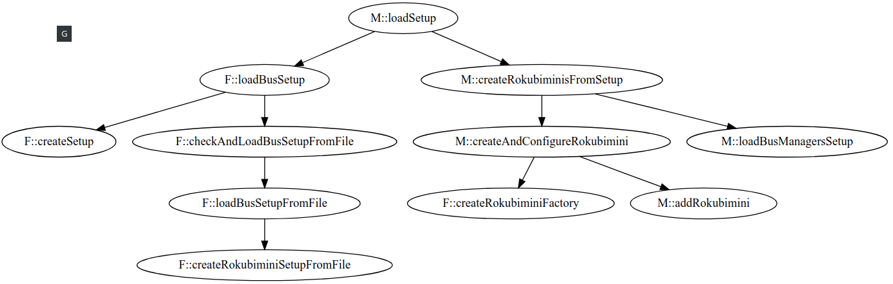

# Rokubi mini 2.0 - Force-Torque Sensor - Implementation Notes

## Overview

This software package provides drivers and a ROS interface for the ethercat & serial version of the rokubi mini force-torque sensor.

The package has 5 core sub-packages:

  * The rokubimini package
  * The manager package
  * The bus_manager package
  * The implementation packages (serial & ethercat)
  * The factory package

And some utility ones:

  * The ros package
  * The msgs package
  * The gazebo_plugin package
  * The description package

The previous packages constitute a library, that the following packages are interfacing with:
  
  * The bota_device_driver package
  * The examples package

In the following sections, we focus on the core sub-packages.

## Design Patterns

The design patterns existing in the core packages are the following:

  * The **Inheritance** paradigm which is used mainly for runtime polymorphism:
      * There is an abstract base class called **Rokubimini**, which holds all the configuration and communication APIs for a rokubi mini device. The following classes are deriving from this base:
          * **RokubiminiSerial**: It's used as an interface (see below) for accessing the serial version of a rokubi mini.
          * **RokubiminiEthercat**: It's used as an interface (see below) for accessing the ethercat version of a rokubi mini.
      * Another abstract base class is called **RokubiminiBusManager**, which holds the APIs relevant to a Bus Manager. The following classes are deriving from this base:
          * **RokubiminiEthercatBusManager**: It's used for handling the EtherCAT communication on the buses and its role includes interacting with the EtherCAT state machine of the devices. It's also used for handling the SDO and PDO traffic to and from the buses.    
          * **RokubiminiSerialBusManager**: It's used mainly for implementing runtime polymorphism, since there is no such thing called "serial bus". Thus, it's a fake implementation which implements a subset of the basic functionalities found in RokubiminiEthercatBusManager.
      * Another abstract base class is called **BaseManager**, which holds the APIs relevant to a Manager. It's mostly there for future considerations. The following class is deriving from this base:
          * **RokubiminiManager**: It's the core manager that orchestrates the entire communication with the devices. It holds a list of the Rokubimini implementations and Bus Managers available. Through the Bus Managers it configures the devices. Each device is represented with the implementation-specific Rokubimini instances (RokubiminiSerial, RokubiminiEthercat, etc).
      * Another abstract base class is called **Rokubimini** located in the **rokubimini::setup** namespace, which holds the APIs relevant to loading a Rokubimini configuration from a setup file in yaml format. The configuration of each rokubi mini device is the same, thus it's implemented in the abstract class. In contrast, the bus setup is different for each implementation, thus it's implemented in the derived implementation-specific classes. The following classes are deriving from this base:
          * **RokubiminiEthercat Setup**: It's used for loading an EtherCAT-specific (ethercat_bus, ethercat_address, etc) Bus Setup from a setup file.    
          * **RokubiminiSerial Setup**: It's used for loading a serial-specific (port,baud rate, etc) Bus Setup from a setup file.   
  * The [Bridge](https://en.wikibooks.org/wiki/C%2B%2B_Programming/Code/Design_Patterns#Bridge) pattern which is the most interesting and complex pattern found in the packages. It's used as a method of [composition instead of inheritance](https://en.wikipedia.org/wiki/Composition_over_inheritance). The following classes are implementing the [Pointer to Implementation](https://en.cppreference.com/w/cpp/language/pimpl) technique and are used for distinguishing between the API of an Interface and its Implementation:
      
      | Interface | Implementation |
      |-----------|----------------|
      | RokubiminiSerial | RokubiminiSerialImpl |
      | RokubiminiEthercat | RokubiminiEthercatSlave |
      
      * RokubiminiSerial / RokubiminiSerialImpl - The reasoning behind this combination is the following: On the one hand we want runtime polymorphism (for the Manager to control everything), so this is the reason for having RokubiminiSerial as a child of Rokubimini. On the other hand, we want distinction between interface (the Rokubimini instance) and it's implementation, so we have created another class called **RokubiminiSerialImpl**. This class is used for implementing the serial communication with the serial version of a rokubi mini. It opens serial ports, sets baud rates and all the other implementation-specific things.
      * The same logic applies to the RokubiminiEthercat / RokubiminiEthercatSlave combination. The only difference is that the **RokubiminiEthercatSlave** implementation is used for implementing the EtherCAT communication with the ethercat version of a rokubi mini. It reads/writes SDOs, configures PDOs and all the other implementation-specific things.

## Rokubimini Factory

So far we discussed design details for the Manager, the Bus Manager, the Implementations (serial & ethercat) and the Rokubimini. The only package left is the factory. This package was developed taking into account the following:
 
 * The Manager wants to hold in a list **abstract** Rokubimini and RokubiminiBusManager instances, for the sake of runtime-polymorphism. Thus the Manager cannot depend on implementations (serial, ethercat etc.)
 * The implementation-specific Rokubiminis (Serial, Ethercat, etc.), RokubiminiBusManagers (Serial, Ethercat, etc.) and Rokubimini Setups (Serial, Ethercat, etc.) need somewhere to be constructed and initialized with implementation-specifics. 

With these in mind, it's evident that there is a need for an implementation-aware package that will undertake all the specifics and provide an implementation-agnostic API to the Manager to call. This was done with the factory package. The package decides what implementation to create each time, based on the setup file (right now it's the product code of each device, but this may change in the future).

## Initialization process

Therefore the complete initialization process is the following (used by bota_device_driver and examples):
  
  * The *Manager* is created.
  * The method *loadSetup(setupFile)* of the *Manager* is called. This produces a multitude of method calls and object creations, via the *Rokubimini* Factory:
      *  A *Setup* is created (which holds a list of all the RokubiminiSetups - in *createSetup()*). For each rokubimini section in the setup file, an implementation-specific *RokubiminiSetup* is created by the Factory (in *createRokubiminiSetupFromFile*) and inserted to the list of *Setup*. The decision on which implementation-specific *RokubiminiSetup* should be created, is based for now on the product code in each section, although this might change in the future. 
      *  Apart from the *RokubiminiSetup*, an implementation-specific *RokubiminiBusManager* is created (if it hasn't been before) and the *RokubiminiSetup* is inserted to the list of the relevant *RokubiminiBusManager* as well. The reason why there are two objects holding a list with RokubiminiSetup instances, is that the *Setup* is used by the *Manager* while each  *RokubiminiBusManager* holds the RokubiminiSetup instances for which is responsible.
      * When the RokubiminiSetups and BusManagers creation phase has finished, the second step for the Manager is to create the actual Rokubimini (implementation-specific and setup-agnostic) instances. This is done through the *createRokubiminiFactory* function (called from *createAndConfigureRokubimini*). After each implementation-specific Rokubimini instance is created, it's added in the list of the Manager.
      * Finally, the *loadSetup* of each BusManager is called, which is used for attaching their Rokubimini instances to the buses and create Implementation pointers for each Rokubimini instance.

A small call graph for the initialization process is the following:

**Note**: The reason why there are two classes with the same name (rokubimini::Rokubimini and rokubimini::setup::Rokubimini) is because the first has the information of the configuration of the device and is setup-agnostic while the second is more related to the bus specifics and is more associated with the setup file (parameters etc). 
	